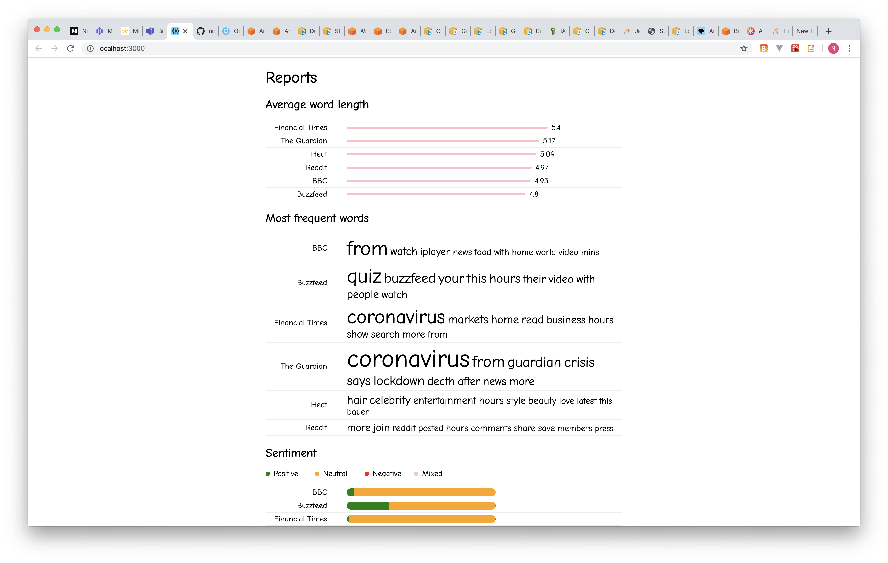

# News Scraper



## About
This project aims to 'scrape' some metrics from the home pages of various news sites, in the hope that it might provide some interesing insight in to the different ways that they present the news.

There is a [list of sites](./server/src/scrape/targets.js) in a JS file that you can add your own to.

You can also [add your own reports](./server/src/process/index.js) if you're willing to get hands on and write a processor. If you do you'll also need to [add a Component to handle the new report](./ui/src/App.js) in the UI.

## Technology
It's a full-stack Javascript project, using Express on the back end, and React on the front end.

## How to run

### Prerequisites

#### Environment
You must have Node (LTS, 12.16.2 at time of writing) installed, and any modern web browser.

#### AWS
To use the Sentiment report you need to have your own [AWS ID, and key](https://docs.aws.amazon.com/general/latest/gr/aws-sec-cred-types.html), because AWS provides the 'Sentiment' processor.

Please be aware that **the AWS Comprehend API (which is used for the sentiment) is not free**, and that the pricing structure may change over time.

Add a file like the following at `./server/src/startup/aws-config.json`.
```json
{
  "accessKeyId": "<AWS_SECRET_ID>",
  "secretAccessKey": "<AWS_SECRET_KEY>",
  "region": "us-east-1"
}
```

### Run
1. Open a terminal. `cd ./server`, then `npm run start:compiler` to start the babel compiler.
2. Open a terminal. `cd ./server`, then `npm run start:server` to start the node server.
3. Open a terminal. `cd ./ui`, then `npm start` to start the user interface, a browser should pop up with the page (if not, navigate to [localhost:3000](http://localhost:3000/) in your browser manually).